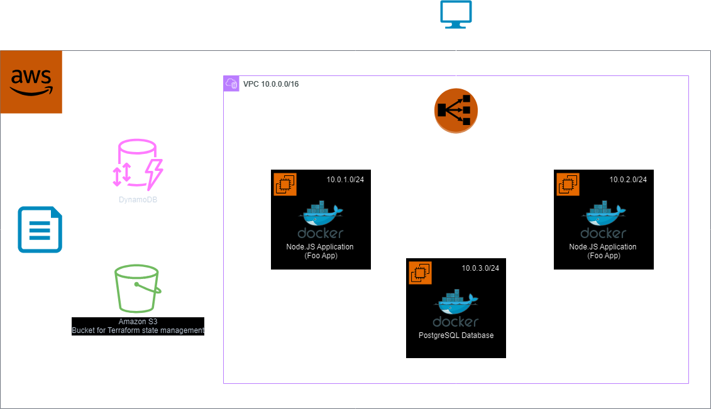

# COSC2759 Assignment 2

## Student details

- Full Names: 
    1. Justin Theofilus Yonathan 
    2. Pandya Limawan
- Student IDs: 
    1. 4115477 
    2. 4115252

## Table of Contents

1. [Student Details](#student-details)
2. [Solution Design](#solution-design)
   - [Overview](#overview)
3. [Infrastructure](#infrastructure)
   - [Architecture](#architecture)
   - [Resiliency Improvements](#resiliency-improvements)
4. [Key Data Flows](#key-data-flows)
5. [Deployment Process](#deployment-process)
   - [Steps to Deploy](#steps-to-deploy)
6. [Prerequisites](#prerequisites)
7. [Description of the GitHub Actions Workflow](#description-of-the-github-actions-workflow)
   - [Triggering Mechanism](#triggering-mechanism)
8. [Backup Process: Deploying from a Shell Script](#backup-process-deploying-from-a-shell-script)
9. [Validating that the App is Working](#validating-that-the-app-is-working)
10. [Contents of This Repo](#contents-of-this-repo)

## Solution design

### Overview

The Foo app is deployed on AWS EC2 instances using Docker, Terraform, and Ansible. The goal is to ensure resilient, automated, and scalable deployment process with multipe EC2 instances of the application. a load balancer for traffic distribution, and a separate EC2 instance for the PostgreSQL database.

Key tools used:
- **Terraform**: For infrastructure provisioning.
- **Ansible**: For configuring instances and deploying the app and database.
- **Docker**: To containerise the app and database.
- **GitHub Actions**: For automating the deployment process.
  
## Infrastructure

### Architecture

- **App Instances**: Two EC2 instances running the app container.
- **Load Balancer**: Balances incoming traffic between the two EC2 instances.
- **Database Instance**: A separate EC2 instance running PostgreSQL.
- **Remote Backend**: Terraform uses S3 bucket for storing state, ensuring consistency and resiliency in infrastructure management.

### Resiliency Improvements

The app is deployed on two EC2 instances behind a load balancer, ensuring high availabiliy. The use of a separate EC2 instance for the database isolates the application logic from data storage, further improving the fault tolerance of the app.

## Key data flows

- **User Traffic**: Users interact with the Foo app via a load balancer, which distributes traffic between the two EC2 instances running the app.
- **App-Database Interaction**: The app communicates with the PostgreSQL database instance over a private network, ensuring secure access to data.

## Deployment process

### Steps to Deploy

1. **Infrastructure Provisioning**:
Terraform is used to provision the required infrastructure (EC2 instances, load balancer, S3 bucket).
A remote backend (S3) is used for Terraform state to ensure shared and consistent state management.
2. **Configuration**:
Ansible is used to configure the EC2 instances (install Docker, pull the app container, and configure PostgreSQL on a separate instance).
3. **Automation**:
GitHub Actions automates the entire process. It triggers the deployment when changes are made to the main branch.

## Prerequisites

1. **AWS Credentials**: Ensure AWS credentials are properly configured for Terraform and Ansible to interact with AWS resources.
2. **Docker**: The app and PostgreSQL database are deployed as Docker containers. The Docker image for the Foo app can be pulled from `mattcul/assignment2app`.
3. **Terraform**: Terraform should be installed locally or as part of a CI/CD pipeline.
4. **Ansible**: Ansible playbooks are used to configure the EC2 instances.
5. **GitHub Actions**: Workflows are defined to trigger deployment automatically upon code changes.

## Description of the GitHub Actions workflow

### Triggering Mechanism

The workflow triggers:

- **Automatically**: When the `main` branch is modified

## Backup Process: Deploying from a Shell Script

As a fallback mechanism, the infrastructure and deployment can be done manually using a shell script. The script performs the following steps:

1. Creates the EC2 instances, load balancer, and S3 bucket using Terraform.
2. Configures the EC2 instances using Ansible to deploy the app and database containers.
3. Starts the Docker containers for both the app and PostgreSQL.

This script can be used if the GitHub Actions workflow encounters any issues.

## Validating that the App is Working

## Contents of This repo

1. **Terraform Configurations**:

Files for provisioning EC2 instances, the load balancer, and remote state using S3.

2. **Ansible Playbooks**:

Playbooks for configuring EC2 instances (installing Docker, setting up containers for the app and database).

3. **Shell Script**:

A script that automates the deployment manually, serving as a backup.

4. **GitHub Actions Workflow**:

A YAML file that defines the workflow for automating the deployment via GitHub Actions.
